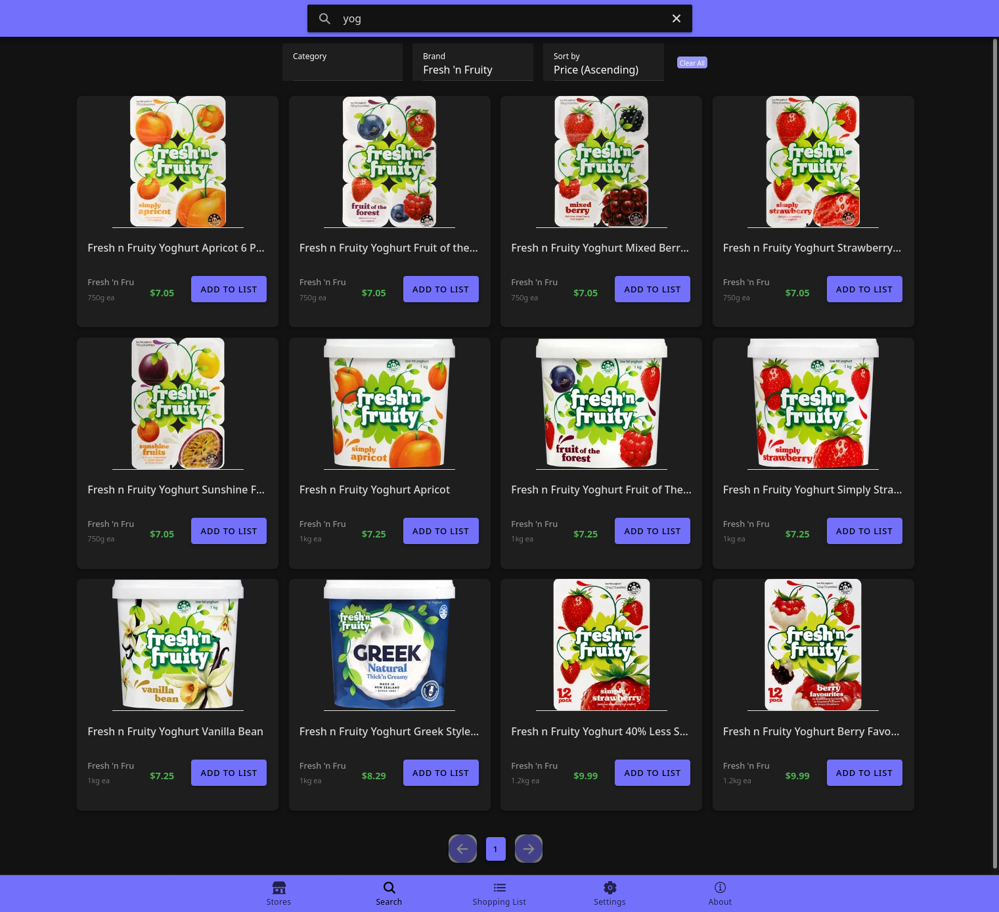

# Grocery Comparison NZ

A simple grocery comparison app to help users find the best prices for their groceries across multiple supermarkets.

This project was developed in cooperation with Haosheng Ye, [Mohammad Munem](https://github.com/mhmunem/cosc680-2024-project), Nandhini Sambasivam, Sam Williams, and Yuchuan Jin.

## Setup

This project uses docker compose for development, testing, and production.

To launch a specific profile. For example, the frontend and backend run: `sudo docker compose --profile backend --profile frontend up`. See [Docker profiles docs](https://docs.docker.com/compose/how-tos/profiles/) for more information.

Available profiles:

- `app`
- `backend`
- `migrate`
- `frontend`
- `scraper`
- `backend_test`
- `e2e_test`

## Features

- Product search
- Filtering and sorting search results
- Price history
- Shopping list
- Retrieve pricing data from [Grocer](https://grocer.nz/).
- Dark mode

